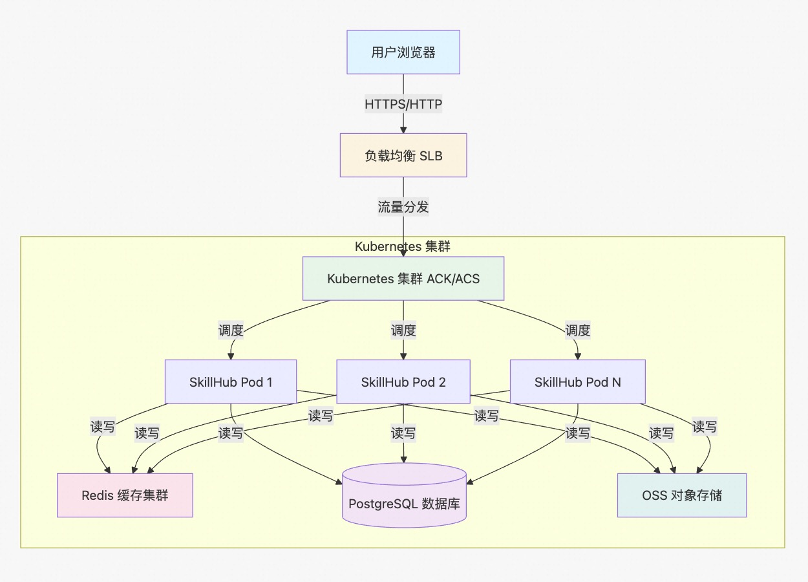
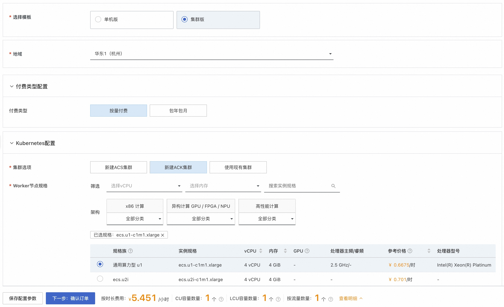
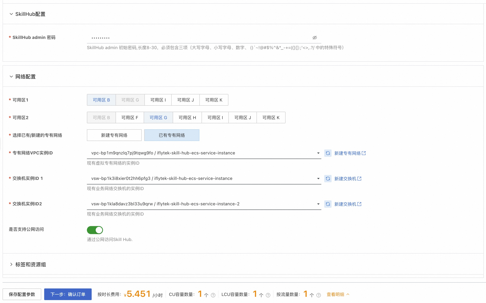
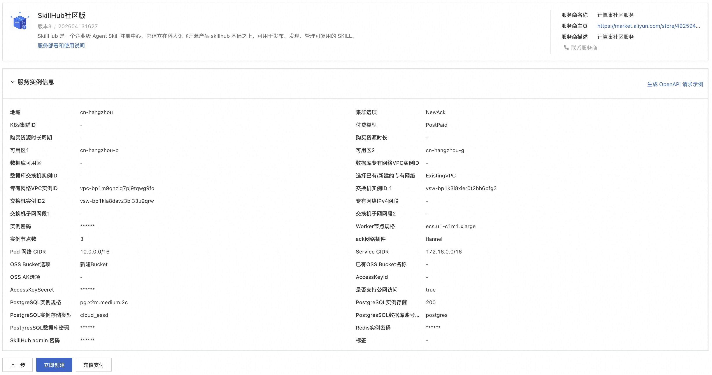
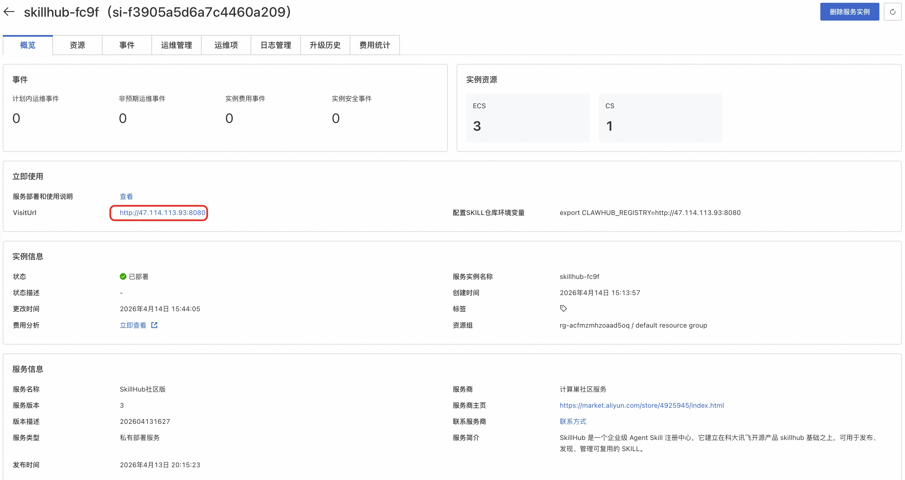

## 概述

SkillHub 是一个企业级 Agent Skill 注册中心，它建立在科大讯飞开源产品 [skillhub](https://github.com/iflytek/skillhub/tree/main) 基础之上，可用于发布、发现、管理可复用的 SKILL。

本方式提供部署集群版 SkillHub 的解决方案，其底层通过 Kubernetes 集群（支持 ACK 和 ACS）进行部署，具备高可用、可伸缩的特性，适合生产环境下使用。

相比单机版，集群版具有以下优势：
- **高可用性**：多节点部署，避免单点故障
- **弹性伸缩**：支持根据负载自动扩缩容
- **生产就绪**：适合企业级生产环境使用
- **统一管理**：集中化的集群管理和监控
- **数据安全**：独立的数据库实例保障数据安全

## 前提条件
部署 SkillHub 集群版服务实例，需要对部分阿里云资源进行访问和创建操作。因此您的账号需要包含如下资源的权限。

**说明**：当您的账号是RAM账号时，才需要添加此权限。

| 权限策略名称                          | 备注                     |
|---------------------------------|------------------------|
| AliyunECSFullAccess             | 管理云服务器服务（ECS）的权限       |
| AliyunVPCFullAccess             | 管理专有网络（VPC）的权限         |
| AliyunROSFullAccess             | 管理资源编排服务（ROS）的权限       |
| AliyunComputeNestUserFullAccess | 管理计算巢服务（ComputeNest）的用户侧权限 |
| AliyunCSFullAccess              | 管理容器服务 Kubernetes 版（CS）的权限 |
| AliyunOSSFullAccess             | 管理对象存储服务（OSS）的权限 |
| AliyunRDSFullAccess             | 管理云数据库服务（RDS）的权限 |
| AliyunKvstoreFullAccess         | 管理云数据库Tair（兼容 Redis）的权限 |

## 计费说明

SkillHub 集群版在计算巢部署的费用主要涉及：

- 集群资源费用（ACK 集群Worker节点或 ACS 实例）
- 所选vCPU与内存规格
- 公网带宽
- 系统盘资源
- 数据库资源（Redis、PostgreSQL）
- 存储资源

## 部署架构



## 参数说明

### 集群配置
| 参数组    | 参数项                     | 说明                                                                     |
|--------|-------------------------|------------------------------------------------------------------------|
| 集群选项   | 集群类型                  | 支持新建ACK集群、新建ACS集群或使用现有集群                                      |
|        | Kubernetes集群ID        | 使用现有集群时需指定集群ID                                                       |
| 可用区配置  | 可用区1 (新建集群时)         | 主可用区，用于部署集群节点或实例                                                     |
|        | 可用区2 (新建集群时)         | 备可用区，用于实现高可用部署                                                       |
|        | 数据库可用区(使用现有集群时)      | 指定Redis和PostgreSQL部署的可用区                                             |

### 网络配置
| 参数组    | 参数项                     | 说明                                                                     |
|--------|-------------------------|------------------------------------------------------------------------|
| 网络配置   | 专有网络选项                | 可选择新建专有网络或复用已有专有网络（新建集群时可选，使用现有集群时固定为已有专有网络）              |
|        | VPC ID (新建集群+选择已有专有网络)   | 已有VPC的实例ID，用于部署新建的K8s集群                                    |
|        | VSwitch ID 1/2 (新建集群+选择已有专有网络) | 已有交换机实例ID，用于部署新建的K8s集群                                 |
|        | VPC IPv4网段 (选择新建专有网络) | 新建VPC时的IP地址段范围，支持10.0.0.0/8、172.16.0.0/12、192.168.0.0/16     |
|        | 交换机子网网段1/2 (选择新建专有网络) | 新建VPC时交换机的子网网段                                                |
|        | 公网访问选项               | 是否启用公网访问，用于外部访问SkillHub服务                                              |

### 资源配置
| 参数组    | 参数项                     | 说明                                                                     |
|--------|-------------------------|------------------------------------------------------------------------|
| 付费类型配置 | 付费类型                  | 资源的计费类型：按量付费(PostPaid)和包年包月(PrePaid)                                |
|        | 购买时长周期                | 包年包月时的时长周期：月或年                                                       |
|        | 购买时长                  | 包年包月时的具体时长，1-9个月或1-6年                                                |
| 资源配置   | Worker节点规格            | ACK集群的Worker节点实例规格                                                     |
|        | 实例节点数                 | ACK集群的Worker节点数量，默认3个，支持1-5000                                      |
|        | 实例密码                  | 节点登录密码，长度8-30，必须包含三项（大写字母、小写字母、数字、特殊符号）                    |
| 网络插件   | ACK网络插件              | 选择flannel或terway-eniip网络插件                                           |

### 数据库配置
| 参数组    | 参数项                     | 说明                                                                     |
|--------|-------------------------|------------------------------------------------------------------------|
| 存储配置   | 数据库可用区(使用现有集群时)      | 指定Redis和PostgreSQL部署的可用区                                             |
|        | 数据库VPC ID (使用现有集群)  | 指定Redis和PostgreSQL部署的VPC，必须与现有集群的VPC一致                     |
|        | 数据库VSwitch ID (使用现有集群) | 指定Redis和PostgreSQL部署的交换机                                      |
|        | Redis实例               | 用于缓存和会话管理的Redis实例                                                     |
|        | PostgreSQL实例          | 用于持久化存储的PostgreSQL数据库实例                                               |

### SkillHub 配置
| 参数组    | 参数项                     | 说明                                                                     |
|--------|-------------------------|------------------------------------------------------------------------|
| SkillHub配置 | 管理员密码              | 设置SkillHub管理员账号(admin)的登录密码                                          |

### OSS 存储配置
| 参数组    | 参数项                     | 说明                                                                     |
|--------|-------------------------|------------------------------------------------------------------------|
| 存储配置   | OSS Bucket选项            | 可选择新建 Bucket 或复用已有 Bucket                                              |
|        | 已有 Bucket 名称(选中已有 Bucket) | 前置创建完毕的、无存储任何数据的空闲 Bucket 名称                                           |
|        | OSS AK选项 (选中已有 Bucket)  | 可选择新建 AK 或复用已有 AK，以便能访问到具体 Bucket                                      |

**重要提示**：使用现有集群时，数据库组件部署的VPC必须与Kubernetes集群的VPC保持一致，否则集群内无法通过内网访问Redis和PostgreSQL实例。

## 部署流程
1. 访问计算巢 [SkillHub集群版](https://computenest.console.aliyun.com/service/instance/create/cn-hangzhou?type=user&ServiceId=service-75e59e84800449c4992b) 服务页面，按提示填写部署参数：


2. 参数填写完成后查看询价明细，确认参数无误后点击**下一步：确认订单**


3. 确认订单完成后同意服务协议并点击**立即创建**，进入部署阶段


4. 等待部署完成后进入服务实例详情页，获取访问地址


5. 通过浏览器访问 SkillHub Web 页面，注册或登录账号(默认账号，用户名 **admin**，密码是创建服务时自行设置的)


6. 登录后即可执行发布 Skill、搜索 Skill、控制台管理 Skill 等操作


## skillHub 与 clawhub 集成

当使用 openclaw，通常会基于 clawub 检索并安装具体 skill，以拓展 openclaw 能力。

为实现 skillHub 与 clawhub 集成，具体需要做如下事情：

- 更新 CLAWHUB_REGISTRY 环境变量

    shell 环境依次执行如下命令即可
    ```
    # 编辑 ~/.bashrc
    echo 'export CLAWHUB_REGISTRY=http://114.55.168.250' >> ~/.bashrc
    
    # 立即生效
    source ~/.bashrc
    
    # 验证
    echo $CLAWHUB_REGISTRY
    ```
    
    注意：上述的 "export CLAWHUB_REGISTRY=http://114.55.168.250"，该内容取自 SkillHub 服务实例详情页的红框部分，实际配置时需按对应服务实例详情页面显示的内容，进行替换。
    

- 查询并安装 skill

    以查询 Git 关键字的 skill，并安装 git-operations skill 为例，shell 环境依次执行如下命令即可，
    ```
    # 搜索 Git 相关技能
    npx clawhub search git
    
    # 查看详细信息
    npx clawhub info git-operations
    
    # 安装单个技能
    npx clawhub install git-operations
    ```