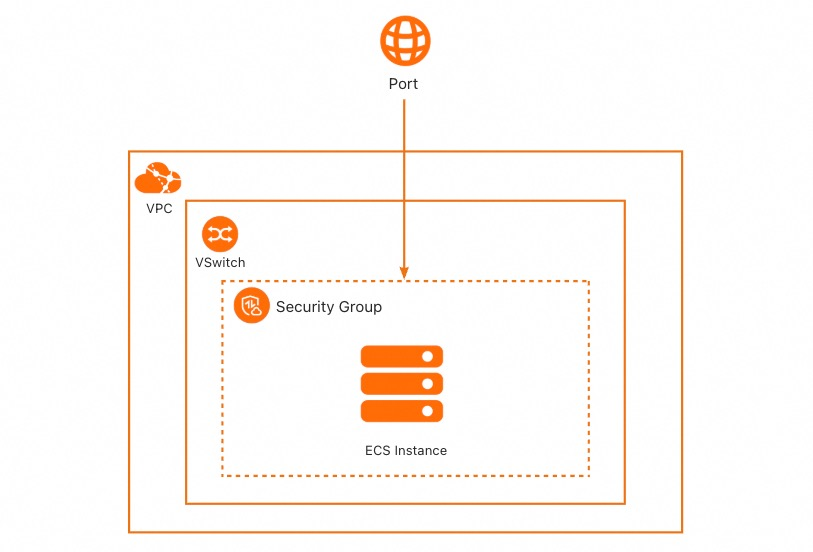
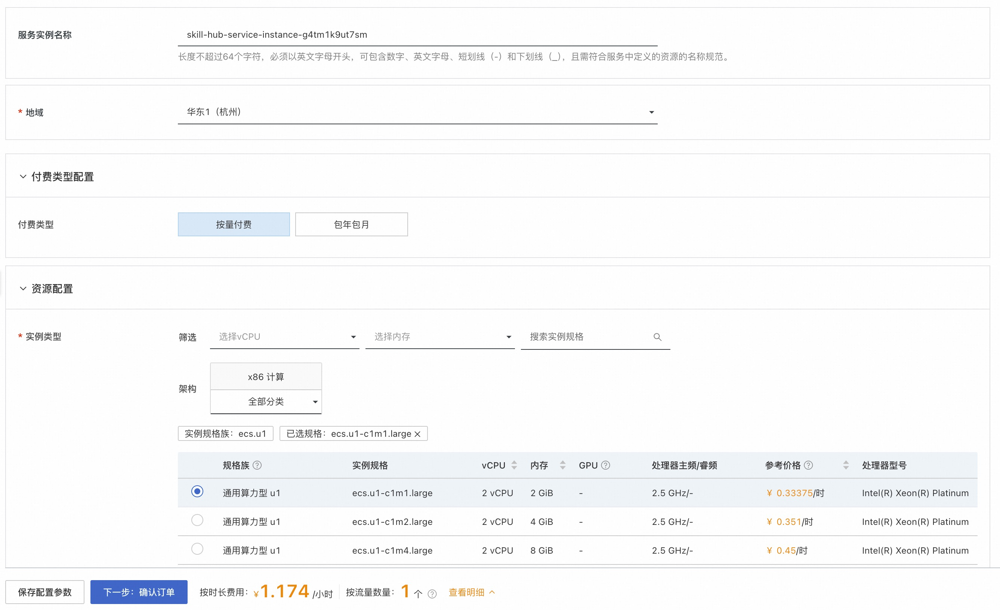
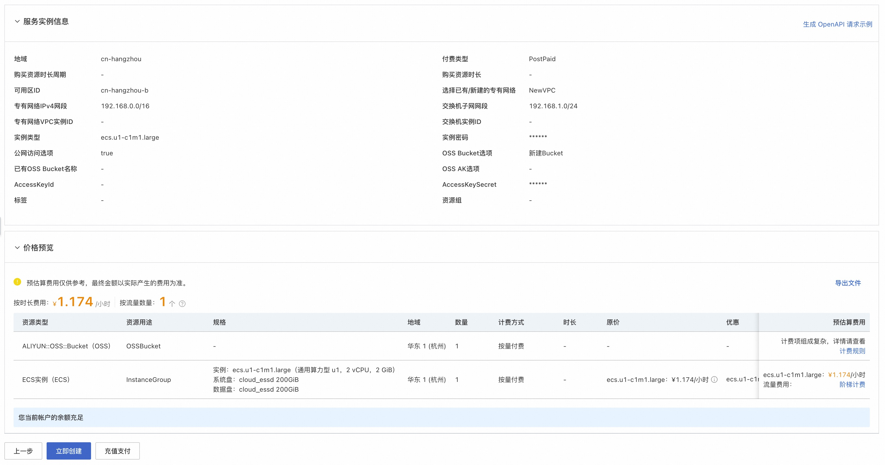
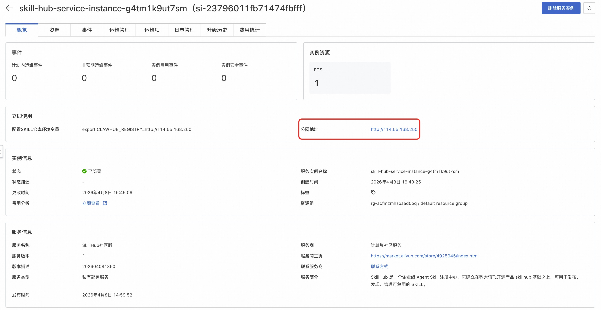
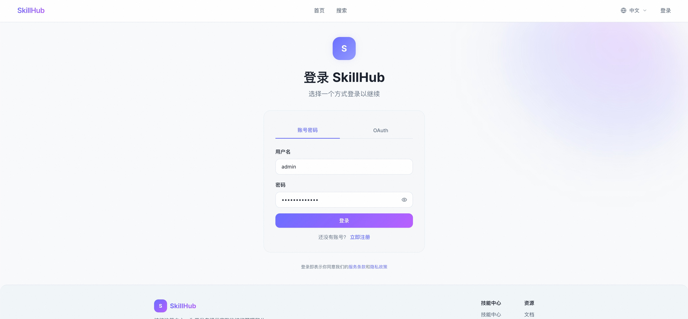
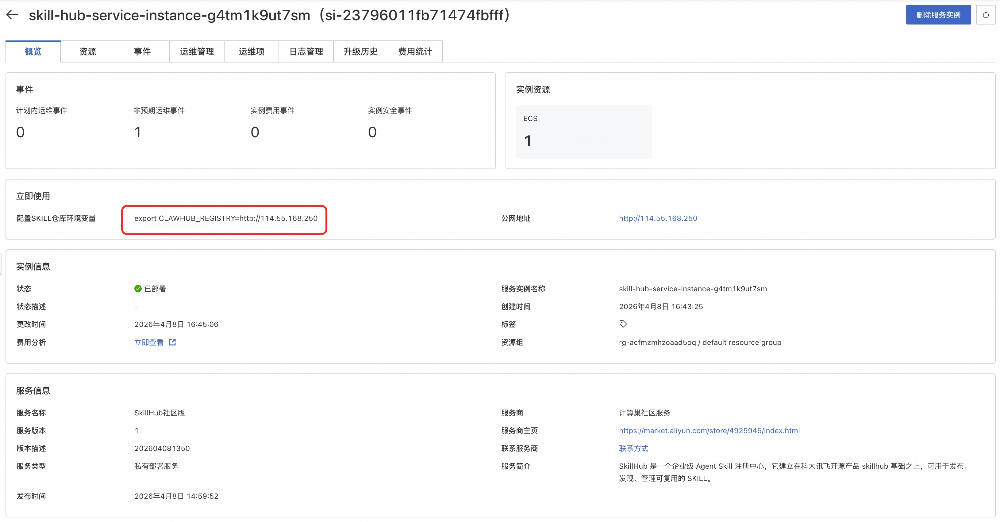

## 概述

SkillHub 是一个企业级 Agent Skill 注册中心，它建立在科大讯飞开源产品 [skillhub](https://github.com/iflytek/skillhub/tree/main) 基础之上，可用于发布、发现、管理可复用的 SKILL。

本方式提供部署单机版 SkillHub 的解决方案，其底层通过 Docker Compose 快速部署 skillhub, 此种部署方式不具备高可用、可伸缩的特性，不适合生产环境下使用，推荐用于开发测试。

## 前提条件
部署 SkillHub 社区版服务实例，需要对部分阿里云资源进行访问和创建操作。因此您的账号需要包含如下资源的权限。

**说明**：当您的账号是RAM账号时，才需要添加此权限。

| 权限策略名称                          | 备注                     |
|---------------------------------|------------------------|
| AliyunECSFullAccess             | 管理云服务器服务（ECS）的权限       |
| AliyunVPCFullAccess             | 管理专有网络（VPC）的权限         |
| AliyunROSFullAccess             | 管理资源编排服务（ROS）的权限       |
| AliyunComputeNestUserFullAccess | 管理计算巢服务（ComputeNest）的用户侧权限 |

## 计费说明

SkillHub 社区版在计算巢部署的费用主要涉及：

- 所选vCPU与内存规格
- 公网带宽
- 系统盘资源
- OSS 资源

## 部署架构



## 参数说明
| 参数组    | 参数项                     | 说明                                                                     |
|--------|-------------------------|------------------------------------------------------------------------|
| 服务实例   | 服务实例名称                  | 长度不超过64个字符，必须以英文字母开头，可包含数字、英文字母、短划线（-）和下划线（_）                          |
|        | 地域                      | 服务实例部署的地域                                                              |
| 付费类型配置 | 付费类型                    | 资源的计费类型：按量付费和包年包月                                                      |
| 资源配置   | 实例类型                    | 可用区下可以使用的实例规格                                                          |
|        | 实例密码                    | 长度8-30，必须包含三项（大写字母、小写字母、数字、 ()`~!@#$%^&*-+=&#124;{}[]:;'<>,.?/ 中的特殊符号） |
|        | 公网访问选项                  | 是否启用公网访问                                                               |
| 可用区配置  | 可用区                     | ECS实例所在可用区                                                             |
|        | 专有网络选项                  | 可选择新建专有网络或复用已有专有网络                                                     |
|        | 专有网络IPV4网段 (选中新建专有网络)   | 设置该专有网络所处网段                                                            |
|        | 交换机子网网段 (选中新建专有网络)      | 设置该专有网络的交换机所处网段                                                        
|        | VPC ID (选中已有专有网络)       | 资源所在VPC                                                                |
|        | 交换机ID (选中已有专有网络)        | 资源所在交换机                                                                |
| 存储配置 | OSS Bucket选项            | 可选择新建 Bucket 或复用已有 Bucket                                              |
| | 已有 Bucket 名称(选中已有 Bucket) | 前置创建完毕的、无存储任何数据的空闲 Bucket 名称                                           |
|| OSS AK选项 (选中已有 Bucket)  | 可选择新建 AK 或服用已有 AK，以便能访问到具体 Bucket                                      |

## 部署流程
1. 访问计算巢[SkillHub社区版](https://computenest.console.aliyun.com/service/instance/create/cn-hangzhou?type=user&ServiceId=service-75e59e84800449c4992b)，按提示填写部署参数：

2. 参数填写完成后可以看到对应询价明细，确认参数后点击**下一步：确认订单**:

3. 确认订单完成后同意服务协议并点击**立即创建**，进入部署阶段：

4. 等待部署完成后就可以开始使用服务，进入服务实例详情点击 "公网地址/内网地址"，以访问 SkillHub Web 页面：

5. Web 页面注册账号 (默认账号，用户名 **admin**，密码 **ChangeMe!2026**)：

6. Web 页面即可执行发布 Skill、搜索 Skill、控制台管理 Skill 等操作：


## skillHub 与 clawhub 集成

当使用 openclaw，通常会基于 clawub 检索并安装具体 skill，以拓展 openclaw 能力。

为实现 skillHub 与 clawhub 集成，具体需要做如下事情：

- 更新 CLAWHUB_REGISTRY 环境变量

shell 环境依次执行如下命令即可
```
# 编辑 ~/.bashrc
echo 'export CLAWHUB_REGISTRY=http://114.55.168.250' >> ~/.bashrc

# 立即生效
source ~/.bashrc

# 验证
echo $CLAWHUB_REGISTRY
```

注意：上述的 "export CLAWHUB_REGISTRY=http://114.55.168.250"，该内容取自 SkillHub 服务实例详情页的红框部分，实际配置时需按对应服务实例详情页面显示的内容，进行替换。


- 查询并安装 skill

以查询 Git 关键字的 skill，并安装 git-operations skill 为例，shell 环境依次执行如下命令即可，
```
# 搜索 Git 相关技能
npx clawhub search git

# 查看详细信息
npx clawhub info git-operations

# 安装单个技能
npx clawhub install git-operations
```